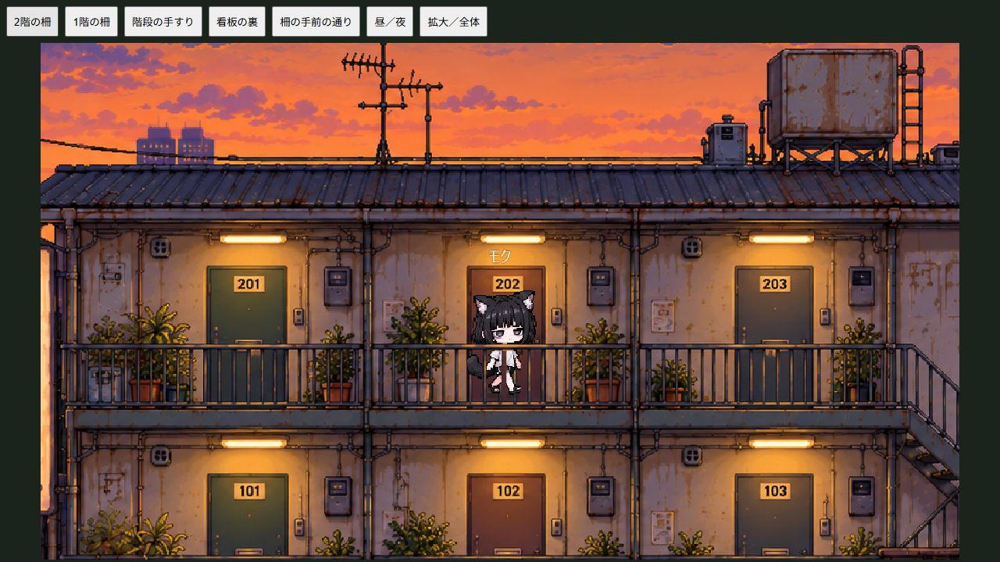
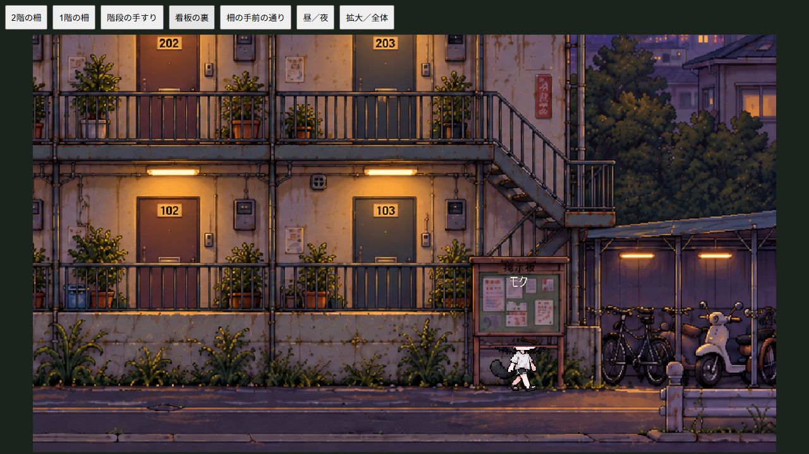

# 外観の柵・看板を手前に表示する

背景原稿は1枚のまま保持。背景→キャラとエフェクト→柵・階段手すり・看板→名前・台詞の順に描画する。

`src/exterior-occlusion.js` の輪郭は1672×941の原稿座標。Canvasのクリップ内へ原稿の同じ位置を再描画するので、別画像の生成やロードは不要。横棒・縦棒の間を塗らずに残す。夜の暗さも同じ値で重ね、手前だけ明るくなることを防ぐ。各住人周辺だけに適用し、他の住人を背景で消さない。

廊下は同じ階の柵の裏、階段は手すりの裏、通りは廊下の柵の手前とする。掲示板の面・支柱と縦看板は遮蔽物として描く。既存の移動経路・セーブ・キャラ素材は変更していない。絵を変更した場合は輪郭の再調整が必要。細い柵は手作業の輪郭なので、拡大表示で確認して調整する。

`npm start` → `/tests/occlusion-visual.html` で上下階・階段・看板・通り・昼夜・拡大/全体を確認できる。実セーブは使わない。`npm run build` で単体版も更新する。

検証：単体版ビルド成功、全25テスト成功。実ブラウザで上記表示を確認、コンソール警告・エラーなし。

