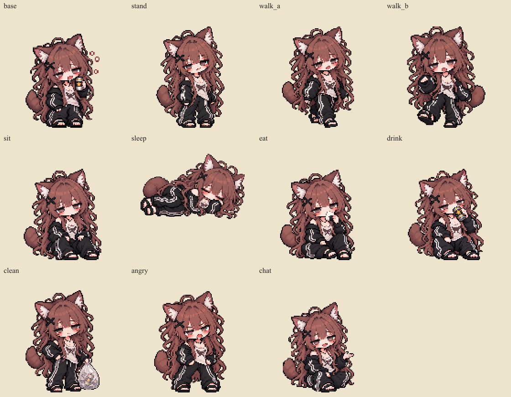
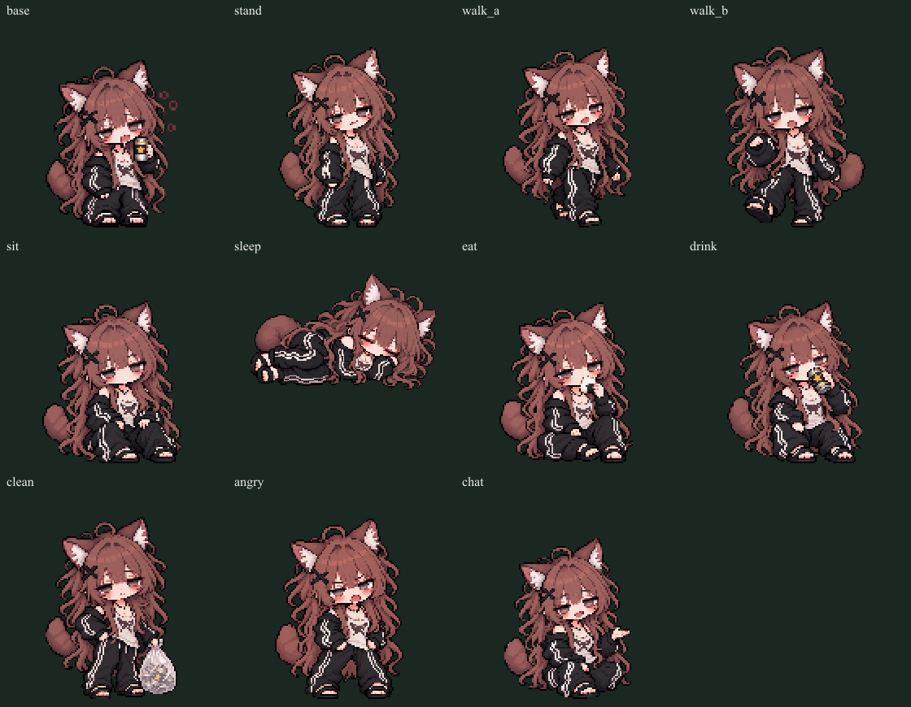
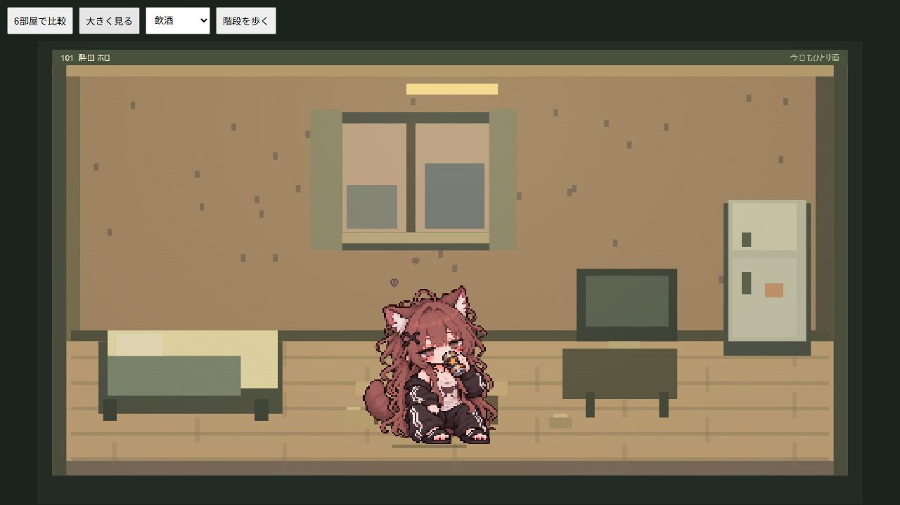

# 酔田ホロの行動差分（2026-10-09）

27歳の酒猫。茶色の長い巻き髪、黒いX髪留め、黒ジャージと白いライン、柄入りインナー、サンダル、半目と赤い頬を原稿に合わせた。組み込みImageGenを使用。生成差分なので完全なピクセル一致は保証しない。

## 素材と動作

原稿・従来の座り画像は変更していない。通常は元の座り絵と新しい座り・立ち・会話をゲーム内30分ごとに切り替える。移動中は歩行2枚、食事・飲酒・掃除・睡眠・口論・会話は各専用ポーズ。歩行はモクと同じ4Hzの切り替えと左右反転。寝姿は横向き画像で呼吸、飲酒は缶を口元へ、掃除は空き缶入りの袋を持つ。

- マスター：`assets/characters/fox/poses/masters/{stand,walk_a,walk_b,sit,sleep,eat,drink,clean,angry,chat}.png`
- ゲーム用：`assets/characters/fox/poses/*.png`（通常128×128、足元64,126／睡眠176×112、基準88,108）
- 元の座り絵のゲーム用：`assets/characters/fox/base-game.png`
- ノート用：`assets/characters/fox/portrait-game.png`

内部ID foxは旧セーブ互換のため維持。最近傍縮小して生成された透明度を保持。白色を背景として削らない。`node tools/prepare-horo.mjs` で再生成（Sharpが必要、別環境のnode_modulesはFERAL_ASSET_MODULE_ROOTで指定）。`npm run build` で単体版へ内蔵する。

## 確認

`npm test` でポーズ選択、歩行切り替え、画像未読込時のフォールバック、フレーム寸法、単体版への全画像内蔵を検証する。開発サーバーの `/tests/horo-visual.html?gallery=1` は実セーブを使わない生活・階段移動の確認用。

## 実際のプロンプト

各画像を個別生成。参照画像は既存 `cutout-master.png`、`transparent_background: true`。CLIフォールバックは使用していない。共通指示：

Use case: identity-preserve. Asset type: one transparent pixel-art game sprite pose of adult cat Horo (27). Reference image is the exact character identity and pixel art style. Preserve long wavy dusty brown hair reaching past waist, loose curls, black X hairclip on left of image, brown cat ears with pale interiors, fluffy brown tail, sleepy grey eyes and flushed cheeks, black loose tracksuit with white stripes, cream patterned undershirt, black sandals, black necklace. Same chibi proportions, dark chunky outlines, restrained dusty palette and square pixel shading. Change only pose/expression/needed held prop as requested below. Entire single character isolated on genuine transparent alpha with 8% padding, full ears tail hair feet visible. No scene, furniture, ground shadow, labels, checkerboard, extra characters, cigarettes or new accessories. No white matte in hair gaps. Keep pale shirt/stripes/skin opaque. Orthographic three-quarter front view matching reference, consistent scale. Pose:

ポーズ指定：

- stand: Standing relaxed on both feet, arms down, empty hands, tired tipsy half smile. Full standing body.
- walk_a: Standing walking step A, left foot forward right foot back, arms swinging lightly, empty hands, tipsy sleepy expression. Not seated.
- sit: Sitting slumped casually on floor with bent knees, hands relaxed on knees, empty hands, sleepy expression. No can.
- eat: Sitting casually, holding one white rice ball near mouth and nibbling it, other hand on knee, sleepy content expression, no can.
- drink: Sitting casually, bringing original black and gold star can to lips, eyes half closed enjoying a sip, other hand resting on knee.
- clean: Standing reluctantly carrying a small transparent-ish pale tied trash bag containing a few empty cans, other hand on hip, tired reluctant expression. Entire body and bag visible.
- angry: Standing feet apart, cheeks flushed, eyebrows annoyed, mouth complaining, hands clenched near waist, comedic grumpy mood not violent, empty hands.
- chat: Sitting relaxed, one hand gesturing palm upward while chatting, small open smile, other hand on knee, empty hands.

- walk_b（最終）：Walking step B, opposite step to typical right-on-image forward. The foot on LEFT side of image is prominently forward and lifted with bent knee, the foot on RIGHT side of image is planted behind. Left side hand raised forward and right side hand swinging backward. Make clearly different foot silhouettes from standing pose. Empty hands, sleepy tipsy face, no floating decorations. Entire body in frame on transparent alpha.
- sleep（最終）：NEW SLEEP POSE: Horo curled on side horizontally, feet at left and head at right, eyes closed, cheek resting on bent arm. Transparent game sprite cutout ONLY. Absolutely NO halo, atmospheric lighting, drop shadow, brown glow, vignette or background color. Outer silhouette ends sharply at fully transparent pixels. Flat pixel-art lighting same as reference. No props.
