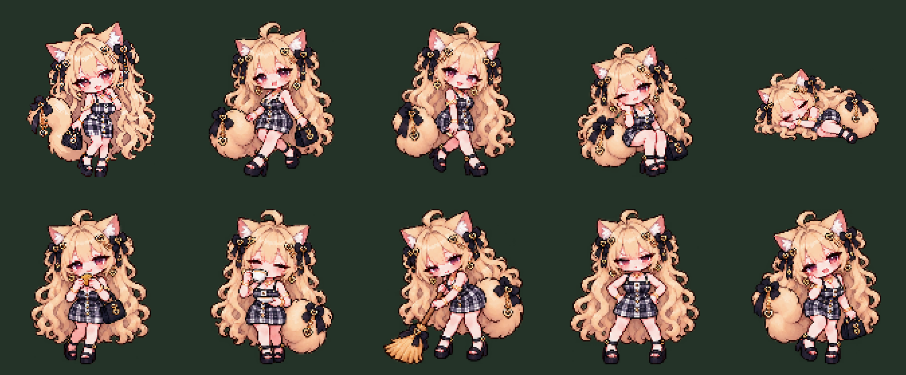

# ルナの画像とモーション（2026-10-10）

添付された新しい金髪・チェック柄ドレスの原稿に差し替え。組み込みImageGenで市松背景を実際の透明アルファへ変換し、同じキャラクターの行動差分を再生成した。原稿と旧立ち絵は保存している。生成画像なので原稿との完全なピクセル一致は保証しない。

## 素材

- `assets/characters/hostess/reference-original.png`：今回の原稿。
- `idle-previous.png`：差し替え前の素材。
- `cutout-master.png`：透過立ち絵マスター。
- `poses/atlas-master.png`：透過3×3差分シート。
- `idle.png`・`portrait.png`・`poses/*.png`：ゲーム用。通常128×128、足元(64,126)。睡眠176×112、下端中央(88,108)。

歩行A/Bは交互に切り替わる。座り・睡眠・食事・飲酒・掃除・怒り・会話の差分をモクと共通の描画処理へ登録。相談は会話ポーズ、テレビは座り。呼吸、寝息、食べかす、掃除の埃、怒り、汗、酔いのハートなど共通エフェクトも連動する。ルナ専用の金色のきらめきと相談中のハートを追加。移動中は相談エフェクトを止める。

`node tools/prepare-luna.mjs` で確認済みPNGから最近傍縮小。白色を背景として削る処理は使用せず、生成画像のアルファを維持する。Sharpの場所は必要に応じて `FERAL_ASSET_MODULE_ROOT` へ指定。続いて `npm run build` で単体版へ内蔵する。

`tests/luna-visual.html` で生活ポーズ、無料相談、階段歩行を確認できる。通常ゲームのセーブは使用しない。`play.html?preview=hostess` は入居状態の確認用。

差分シートは生成時の枠から一部はみ出したため、`prepare-luna.mjs` には目視確認した透明な隙間の切り出し座標を保存。髪・尾・足・小物を欠かさず取り出している。別のシートへ交換するときは切り出し位置を再確認する。

検証：単体版ビルド成功（40画像内蔵）、自動テスト40件成功。実ブラウザで生活差分・相談・階段歩行・単体版を確認し、読み込み警告と実行エラーなし。ゲーム用素材の透明アルファ・寸法と足元基準を確認。

## 生成指示

組み込みImageGenを使用。すべて `transparent_background: true`、今回の原稿を参照。

立ち絵：市松模様を髪・手・尻尾・脚の隙間まで実際の透明にし、25歳のルナの全身ポーズ、長い金髪、猫耳、尻尾、紫の瞳、黒いリボンと金ハート、チェック柄ドレス、バッグ、黒サンダルとピクセルアートを保持。白い肌や耳の内側は残す。文字・背景・影を追加しない。

差分：同じ成人キャラクターを透明3×3シートで生成。上段は歩行A・歩行B・座り、中段は横向き睡眠・食事・飲酒、下段は掃除・怒り・会話。各セルの上下左右12%以上を透明余白とし、キャラと小物を中央76%以内へ収める。見た目・衣装・髪・アクセサリーを統一し、家具・文字・市松模様・固定の怒りや会話記号は描かない。
