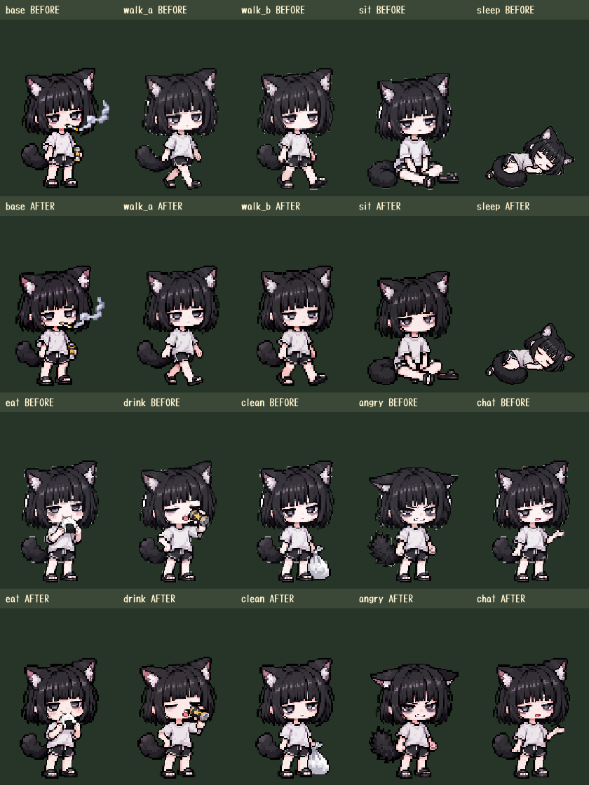
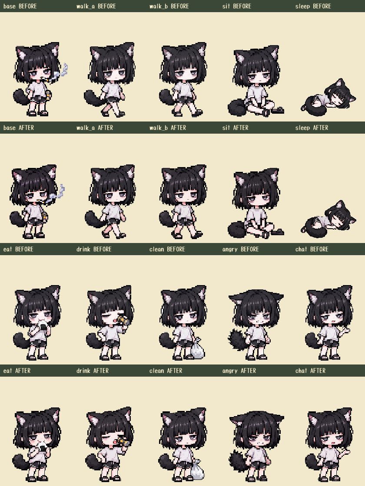
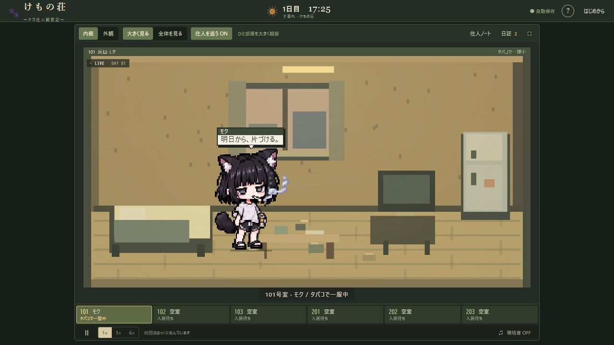

# モクの背景透過修正（2026-10-09）

髪の隙間や外周に白背景が残り、旧ポーズ処理は白に近い服・小物も背景として削除していた。組み込みImageGenで基本立ち絵と9ポーズを個別に透過編集し、白色削除・輪郭侵食を廃止した。原稿は変更していない。生成編集のため、原稿との完全なピクセル一致は保証しない。

## 比較

各列の左が修正前、右が修正後。上から立ち・歩行A・歩行B・座り・睡眠、食事・飲酒・掃除・怒り・会話。

## 保存先と再生成

- 基本立ち絵：`assets/characters/cat/cutout-master.png` → `cutout.png`・`idle.png`・`portrait.png`
- 差分：`assets/characters/cat/poses/cutouts/*.png` → `poses/*.png`
- 原稿：`reference-original.png`、`poses/raw/*.jpg`
- 寸法・足元は既存の `src/character-art.js` に一致。通常96×128、睡眠160×112。最近傍縮小でアルファを維持する。

素材処理にはSharpが必要。`node tools/prepare-cat.mjs` で全素材を再生成し、`npm run build` で単体版へ内蔵する。Sharpを別環境から読む場合は `FERAL_ASSET_MODULE_ROOT` にそのnode_modulesディレクトリを指定する。旧Python入口もこのNode処理を呼び出す。

## 検証結果

`npm run build` 成功（14画像内蔵）、`npm test` は15件すべて成功。分割版のポーズ確認画面と単体版の内装拡大を実ブラウザで確認し、警告・エラーなし。移動・セーブのコードは変更していない。

## 実際の編集プロンプト

組み込みImageGenを使用し、各原稿1枚を参照、`transparent_background: true`。外部ツールへのフォールバックは使用していない。

### 基本立ち絵

Use case: background-extraction. Edit target: the single supplied original pixel-art adult cat humanoid Moku. Remove only the white background into true transparent alpha. Keep EXACT pose, silhouette, sleepy face, short black bob, black cat ears with pale inner ears, light grey shirt, black shorts, pale limbs, dark sandals, tail, cigarette, its entire curled smoke, black-and-gold can, and original square pixel blocks. No redesign or added details. Keep all pale clothing, skin, ear interiors and white cigarette fully opaque. Remove ALL white background residue including between the legs, tail and arm, little hair gaps and inside/around the smoke curls. No white matte or bright halo, no isolated background flecks, no checkerboard painted into the pixels, no dark background. Make a clean crisp cutout that looks clean over both dark green and cream backgrounds. Do not erase black outline or fine hair strands. Preserve the source framing and proportions as closely as possible, full character including smoke and sandals visible with transparent padding.

### 各ポーズ共通

Use case: background-extraction. Edit target: the supplied single existing pixel-art adult cat humanoid Moku pose. Remove ONLY its white background to true alpha, including every tiny white background pocket in the hair outline, limbs, ears and around props. Preserve exactly the input pose, facial expression, silhouette, black bob hair and ears, pale ear interiors and skin, light grey tshirt, dark shorts and sandals, tail and any existing object. Do not add a cigarette or can if absent. Preserve pale shirt highlights, white food, light bag and skin as fully opaque foreground. No white matte, no halo, no background flecks or checkerboard painted into the image. Crisp square pixel-art boundaries, not fuzzy or antialiased new illustration. Keep the same input canvas proportions, scale, margins and framing as closely as possible. Do not enlarge the character, crop anything, reposition body parts or redesign the artwork. This is a faithful transparency repair, not a new pose.
